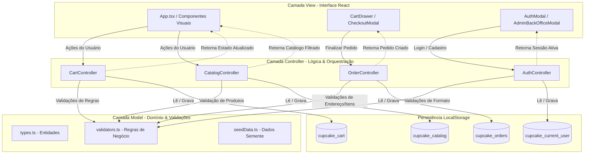
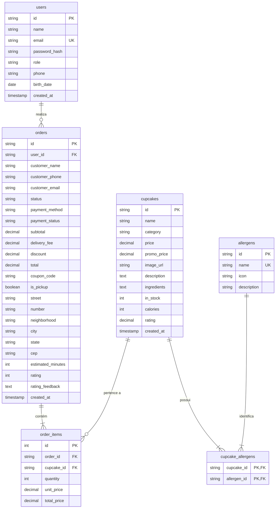

# Sweet Bliss Cupcakes — PIT II (Sistemas de Informação)

> **Projeto Integrador Transdisciplinar em Sistemas de Informação II (PIT II)**  
> **Situação-Problema 2:** Padrão Arquitetural MVC, Persistência Relacional e Separação Rigorosa de Camadas  
> **Tecnologias:** React 19, TypeScript, Tailwind CSS, LocalStorage Persistence & ANSI SQL (MySQL/PostgreSQL)

---

## 1. Visão Geral e Contextualização do Projeto

O **Sweet Bliss Cupcakes** é uma plataforma e-commerce de confeitaria artesanal de alta gastronomia, desenvolvida como solução prática e aplicada para as disciplinas de Engenharia de Software e Banco de Dados do curso de Bacharelado em Sistemas de Informação.

### Alinhamento PIT I vs. PIT II
* **No PIT I (Planejamento e Requisitos):** Foram realizados o levantamento de requisitos funcionais e não-funcionais, mapeamento de regras de negócio (cálculo de taxas de entrega, regras de pedidos mínimos, restrições alimentares e políticas de cancelamento), além da prototipação inicial da interface de usuário (IHC).
* **No PIT II (Arquitetura, Engenharia e Persistência):** O foco concentrou-se na **Situação-Problema 2**, que demanda a **adequação da arquitetura do software ao padrão MVC (Model-View-Controller)**, desacoplamento rigoroso da camada de apresentação, persistência de dados bidirecional com suporte a recarga de página (F5) via `localStorage` e o projeto físico completo de **Banco de Dados Relacional (`database/schema.sql`)**.

---

## 2. Mapeamento Arquitetural MVC (Model-View-Controller)

A aplicação segue uma separação estrita de responsabilidades, dividindo o código-fonte (`src/`) em três camadas bem definidas:

```
src/
├── models/                     # 1. CAMADA MODEL
│   ├── types.ts                # Contratos de tipos, interfaces de domínio e DTOs
│   ├── validators.ts           # Regras de negócio puras (validações de pedidos, auth, estoque)
│   └── seedData.ts             # Dados sementes de catálogo, usuários e cupons
│
├── controllers/                # 2. CAMADA CONTROLLER
│   ├── CartController.ts       # Gestão do carrinho, subtotais, frete, descontos e persistência
│   ├── OrderController.ts      # Ciclo de vida dos pedidos, rastreamento, status e histórico
│   ├── AuthController.ts       # Autenticação de clientes/admin, proteção brute-force e sessões
│   └── CatalogController.ts    # Gestão de produtos, filtros inteligentes, baixa de estoque e CRUD
│
├── components/ (Views)         # 3. CAMADA VIEW
│   ├── Header.tsx              # Barra de navegação e status da sessão
│   ├── AppPrototype.tsx        # Vitrine de produtos e filtros visuais
│   ├── CupcakeCard.tsx         # Card visual do produto
│   ├── CupcakeDetailModal.tsx  # Detalhes nutricionais, alérgenos e compra
│   ├── CartDrawer.tsx          # Drawer visual do carrinho de compras
│   ├── CheckoutModal.tsx       # Fluxo de checkout (PIX, Cartão, Dinheiro)
│   ├── OrderStatusModal.tsx    # Rastreamento em tempo real do pedido
│   ├── OrderHistoryModal.tsx   # Histórico e avaliação do cliente
│   ├── AuthModal.tsx           # Telas de login e cadastro de clientes
│   ├── AdminAuthModal.tsx      # Autenticação de gestores
│   ├── AdminBackOfficeModal.tsx# Painel administrativo de controle de estoque e pedidos
│   └── UserProfileModal.tsx    # Gestão de perfil do cliente
│
├── App.tsx                     # View Orquestradora conectada aos Controllers
├── main.tsx                    # Ponto de entrada React
└── index.css                   # Estilização global Tailwind CSS
```

### 2.1 Camada Model (`src/models/`)
Responsável pelas entidades de domínio, regras de consistência lógica e dados estruturados:
* **`types.ts`:** Define os tipos de domínio (`Cupcake`, `CartItem`, `Order`, `OrderAddress`, `User`, `Coupon`, `AllergenType`, etc.).
* **`validators.ts`:** Concentra as regras de negócio em classes utilitárias e métodos estáticos:
  * `OrderValidator`: validação de itens de pedido, valor mínimo de R$ 20,00, campos obrigatórios de endereço (CEP com 8 dígitos, rua, bairro, número) e cálculo de troco para pagamentos em dinheiro.
  * `AuthValidator`: validação de formato de e-mail (RFC regex), regras de senha (mínimo 6 caracteres) e máscara/validação de telefone com DDD.
  * `CupcakeValidator`: validação de preço positivo, estoque não negativo e integridade cadastral de produtos.
  * `AllergenValidator`: verificação e compatibilidade de alérgenos alimentares.
* **`seedData.ts`:** Catálogo oficial com os 9 cupcakes gourmet artesanais, massa de dados de clientes e cupons promocionais ativos (`PRIMEIRACOMPRA`, `FRETEGRATIS`, `SWEET15`).

### 2.2 Camada Controller (`src/controllers/`)
Intermedia a comunicação entre as Views e os Models, executando as regras de negócio e gerenciando a persistência no `localStorage`:
* **`CartController.ts`:** Adiciona cupcakes (com validação de login obrigatório e estoque disponível), atualiza quantidades, calcula subtotais, frete (grátis via cupom ou balcão), cupons de desconto e persiste em `cupcake_cart`.
* **`OrderController.ts`:** Valida dados de entrega, gera códigos de rastreio oficiais (`PED-XXXXXX`), cria pedidos com persistência em `cupcake_orders`, atualiza status (`Aguardando Pagamento` ➔ `Em Produção` ➔ `Em Entrega` ➔ `Entregue`) e registra avaliações/feedback de clientes.
* **`AuthController.ts`:** Realiza login e registro de clientes, proteção contra ataques de força bruta (bloqueio por 5 minutos após 5 tentativas incorretas), controle de sessão ativa (`cupcake_current_user`), atualização de perfil e autenticação de administradores no back-office.
* **`CatalogController.ts`:** Carrega o catálogo do `localStorage` (`cupcake_catalog`), filtra produtos por categoria, busca textual e exclusão de alérgenos, efetua baixa de estoque após compra confirmada e fornece operações CRUD completas para gestores.

### 2.3 Camada View (`src/components/` & `src/App.tsx`)
Atua **estritamente como apresentação visual (IHC)**. Os componentes não contêm lógica de persistência direta nem regras de negócio arbitrárias, delegando todas as ações para a camada Controller:
* O formulário de login aciona `AuthController.login(email, password)`.
* O carrinho consulta `CartController.calculateTotals(items)`.
* O checkout finaliza através de `OrderController.createOrder(input)`.
* O catálogo é filtrado através de `CatalogController.filterCatalog(...)`.

### Diagrama de Fluxo MVC


---

## 3. Projeto Físico de Banco de Dados Relacional (`database/schema.sql`)

Para atendimento aos critérios de persistência relacional do PIT II, foi desenvolvido na pasta `database/` o script `schema.sql` em padrão ANSI SQL, totalmente compatível com **MySQL 8.0+** e **PostgreSQL 14+**.

### 3.1 Dicionário de Tabelas Relacionais

| Tabela | Finalidade | Chave Primária (PK) | Chaves Estrangeiras (FK) |
|---|---|---|---|
| `users` | Clientes cadastrados e gestores administrativos | `id` (VARCHAR) | — |
| `cupcakes` | Catálogo de produtos, estoque, preços e calorias | `id` (VARCHAR) | — |
| `allergens` | Cadastro central de alérgenos alimentares | `id` (VARCHAR) | — |
| `cupcake_allergens` | Tabela associativa (relação N:M entre Cupcake e Alérgeno) | `(cupcake_id, allergen_id)` | `cupcake_id` ➔ `cupcakes.id`<br>`allergen_id` ➔ `allergens.id` |
| `orders` | Cabeçalho dos pedidos, dados de entrega, valores e status | `id` (VARCHAR - Ex: PED-123456) | `user_id` ➔ `users.id` (ON DELETE SET NULL) |
| `order_items` | Itens integrantes do pedido com quantidade e preços | `id` (INT AUTO_INCREMENT) | `order_id` ➔ `orders.id` (ON DELETE CASCADE)<br>`cupcake_id` ➔ `cupcakes.id` |

### 3.2 Diagrama Entidade-Relacionamento (DER)


### 3.3 Carga DML e Integridade Referencial
O script `database/schema.sql` contém a massa de dados inicial idêntica à vitrine da loja:
* **5 alérgenos catalogados** (Glúten, Lactose, Ovos, Nozes/Castanhas e Soja).
* **9 cupcakes completos** com fotos reais de confeitaria, preços, ingredientes, calorias e estoque real.
* **Relacionamento completo em `cupcake_allergens`** para cada produto.
* **Usuários de teste:** Cliente (`cliente@sweetbliss.com` / `senha123`) e Administrador (`admin@sweetbliss.com.br` / `admin123`).
* **Pedido de demonstração** com seus itens associados validando integridade referencial.

---

## 4. Princípios de IHC (Interface Humano-Computador)

A aplicação foi projetada e avaliada com base nas **10 Heurísticas de Usabilidade de Jakob Nielsen**:

1. **Visibilidade do Status do Sistema:** O modal de rastreamento exibe o status operacional do pedido em tempo real (*Aguardando Pagamento*, *Em Produção*, *Em Entrega*, *Entregue*), barra de progresso animada e tempo estimado de entrega.
2. **Correspondência entre o Sistema e o Mundo Real:** Metáforas de cardápio gourmet tradicional, termos do cotidiano do cliente (Delivery, Retirada no Balcão, Troco), moeda em Reais (`R$`) e ícones ilustrativos de confeitaria.
3. **Controle do Usuário e Liberdade:** O cliente pode alterar quantidades, remover produtos do carrinho individualmente, limpar todo o carrinho com um clique, fechar modais a qualquer instante e cancelar edições de perfil.
4. **Consistência e Padronização:** Identidade visual coesa com tons *rose*, *stone* e *amber*, tipografia moderna, botões com estados interativos e ícones consistentes da biblioteca `lucide-react`.
5. **Prevenção de Erros:** O sistema valida o CEP automaticamente na base ViaCEP, bloqueia o avanço de pedidos abaixo do valor mínimo (R$ 20,00), restringe a adição ao carrinho caso o estoque seja 0 e bloqueia logins após 5 tentativas incorretas consecutivas.
6. **Reconhecimento em vez de Memorização:** Badges destacados informam a presença de alérgenos alimentares (glúten, lactose, nozes) e contagem de calorias diretamente no card do produto, sem obrigar o usuário a ler textos extensos.
7. **Flexibilidade e Eficiência de Uso:** Busca dinâmica que pesquisa instantaneamente por nome, descrição, ingredientes ou alérgenos; atalhos por categoria (*Gourmet*, *Vegano*, *Zero Açúcar*, *Sazonais*); e preenchimento automático de endereço para clientes autenticados.
8. **Estética e Design Minimalista:** Interface *clean* e responsiva, priorizando foco nos produtos com fotografia gastronômica de alta resolução e tipografia legível.
9. **Auxílio para Reconhecer, Diagnosticar e Recuperar-se de Erros:** Mensagens de erro em linguagem natural e amigável (ex.: *"Por favor, informe seu telefone/WhatsApp com DDD"* ou *"O valor em dinheiro informado é menor que o total do pedido"*).
10. **Ajuda e Documentação:** Rodapé institucional com horários de atendimento, tempo médio de entrega, canais de suporte via WhatsApp e orientações de segurança alimentar.

---

## 5. Instruções de Execução Local

### 5.1 Pré-requisitos
* **Node.js**: Versão 18.0 ou superior instalada.
* **NPM**: Versão 9.0 ou superior.
* **Navegador Web**: Google Chrome, Mozilla Firefox, Microsoft Edge ou Safari atualizado.
* *(Opcional para execução do script de BD)*: SGBD MySQL Workbench, DBeaver ou pgAdmin.

### 5.2 Instalação e Execução da Aplicação

1. Clone ou acerte o repositório na sua máquina local:
   ```bash
   cd sweet-bliss-cupcakes
   ```

2. Instale as dependências do projeto:
   ```bash
   npm install
   ```

3. Execute a verificação estrita de tipagem (TypeScript):
   ```bash
   npm run lint
   ```

4. Inicie o servidor de desenvolvimento Vite:
   ```bash
   npm run dev
   ```
   A aplicação estará acessível em: `http://localhost:3000`

5. Para gerar o build otimizado de produção:
   ```bash
   npm run build
   ```

### 5.3 Execução do Banco de Dados (`schema.sql`)

Para criar e testar o banco de dados relacional:
1. Abra seu cliente SQL preferido (**MySQL Workbench**, **DBeaver** ou via terminal `mysql -u root -p`).
2. Abra o arquivo localizado em `database/schema.sql`.
3. Execute o script completo. O banco `sweet_bliss_db` será criado, com todas as 6 tabelas, constraints e os dados da vitrine populados.

### 5.4 Credenciais de Acesso para Avaliação Acadêmica

| Perfil | E-mail / Usuário | Senha | Funcionalidades Habilitadas |
|---|---|---|---|
| **Cliente Demo** | `cliente@sweetbliss.com` | `senha123` | Fazer pedidos, checkout PIX/Cartão/Dinheiro, histórico e avaliação |
| **Administrador** | `admin` *(ou `admin@sweetbliss.com.br`)* | `admin123` | Acesso ao Back-Office, gestão de estoque, cadastro de cupcakes e atualização de status de pedidos |

---

## 6. Integrantes e Informações Acadêmicas

* **Curso:** Bacharelado em Sistemas de Informação
* **Projeto:** Projeto Integrador Transdisciplinar em Sistemas de Informação II (PIT II)
* **Tema / Situação-Problema:** Situação-Problema 2 — Arquitetura MVC, Persistência Relacional e IHC
* **Ano:** 2026
